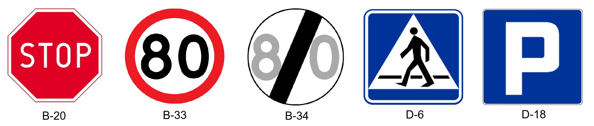

# Line Follower
It's a robot that has simple task to follow the line while charging forward.

## Table of contents
- [Introduction](#introduction)
- [Installation](#installation)
- [Line detection](#line-detection)
- [Traffic sign recognition](#traffic-sign-recognition)
- [Assembly](#assembly)
- [License](#license)
- [Literature](#literature)

## Introduction
<p align="center">
    
    
    
</p>

This is one of student projects, that is supposed to help acquire knowledge of AI, embedded systems and 3D printing. We have used many frameworks including ROS and Yolo. This project is supposed to learn more about autonomous vehicles and its design. The goal is to equip line follower with TSR and maximize its reactions to the traffic signs.

## Installation

1. Open your powershell and clone repository:
    ```
    git clone https://github.com/AveePB/TSR.git
    ```
2. Open the project folder and create virtual environment:
    ```
    python -m venv env
    ```
3. Activate your python environment:
    ```
    ./env/bin/activate
    ```
4. Download required libraries from the txt file:
    ```
    pip install -r requirements.txt
    ```
5. Change directory
    ```
    cd robot
    ```
6. Run the python file
    ```
    python main.py
    ```
## Line detection
...

## Traffic sign recognition
TSR is a technology by which a vehicle is able to recognize the traffic signs put on the road, such as speed limits, stop signs and other warnings. The system then provides this information to the driver, typically through the display.

### Camera input
...

### Sign detection 
...

### Sign classification


Objects detected by the camera are assigned one of the lables:
 - **B-20**: Stop sign,
 - **B-33**: Start of speed limit,
 - **B-34**: End of speed limit,
 - **D-6**: Zebra crossing in a few meters,
 - **None**: Object was not recognized as one of the traffic signs. 


## Assembly
...

## License
This project is licensed under the MIT License. See the LICENSE file for details.

## Literature
List of sources:
- <a href="https://freertos.org/Documentation/02-Kernel/07-Books-and-manual/01-RTOS_book">FreeRTOS Documentation</a>,
- <a href="https://docs.ultralytics.com/">Yolo Documentation</a>
