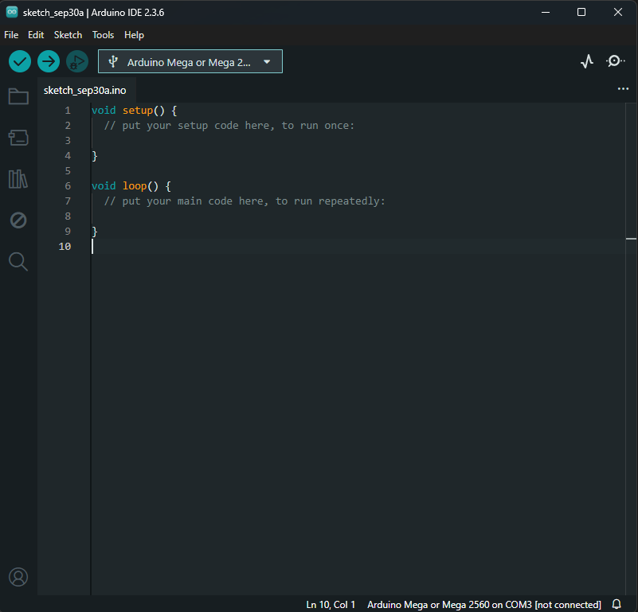
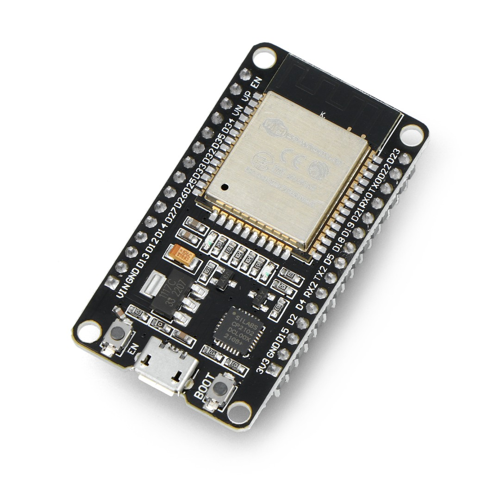

## Tests of electronics

After wiring the robot I decided to test If all signals are sent as expected.
To test devices I have used the ESP32 DEV MODULE with Arduino IDE.

### Tests
- **Ultrasonic.ino**: is responsible for a test of the ultrasonic sensor (read/ping);
- **Qtr8.ino**: contains a test of the line sensor (read);
- **Motors.ino**: has tests for motor spinning tasks;